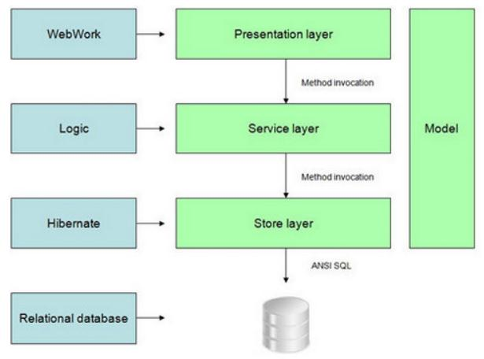

# Understanding DHIS 2 web-app
A packaged app is an Open Web App that has all of its resources (HTML, CSS, JavaScript, app manifest, and so on) contained in a zip file and can be uploaded to a DHIS 2 installation at runtime. A packaged app is a zip file with an app manifest in its root directory.

The purpose of packaged apps is to extend the web interface of DHIS 2. A system deployment will often have custom and unique requirements. The apps provide a convenient extension point to the user interface. Through apps, we can complement and customize the DHIS 2 core functionality with custom solutions in a loosely coupled and clean manner. Apps do not have permissions to interact directly with DHIS 2 Java API. Instead, apps are expected to use functionality and interact with the DHIS 2 services and data by utilizing the DHIS 2 Web API.

The Web API is a component which makes it possible for external systems to access and manipulate data stored in an instance of DHIS 2. More precisely, it provides a programmatic interface to a wide range of exposed data and service methods for applications such as third-party software clients, web portals and internal DHIS 2 modules.

Below is DHIS 2 technical architecture as documented in developer manual.  
DHIS 2 web-app is part of presentation layer which communicates to service layer through Web API. 

References: 
DHIS user manual (https://www.dhis2.org/doc/snapshot/en/end-user/html/dhis2_end_user_manual.html)
DHIS developer manual (https://www.dhis2.org/doc/snapshot/en/developer/dhis2_developer_manual.pdf)

