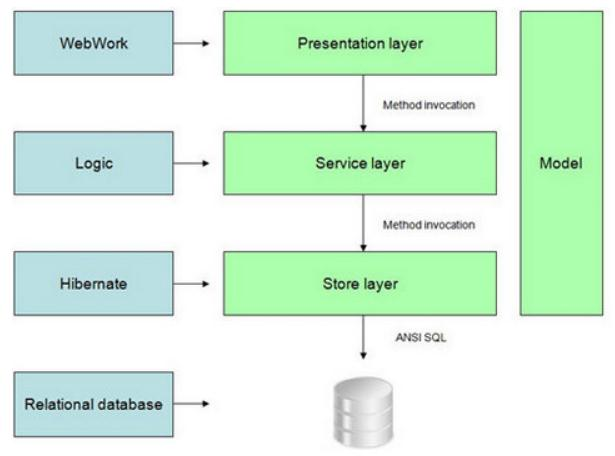

# Understanding DHIS 2 web-app

## DHIS2 web-app
A packaged app is an Open Web App that has all of its resources (HTML, CSS,
JavaScript, app manifest, and so on) contained in a zip file and can be uploaded
to a DHIS 2 installation at runtime. A packaged app is a zip file with an app
manifest in its root directory.

The purpose of packaged apps is to extend the web interface of DHIS 2. A system
deployment will often have custom and unique requirements. The apps provide a
convenient extension point to the user interface. Through apps, we can
complement and customize the DHIS 2 core functionality with custom solutions in
a loosely coupled and clean manner. Apps do not have permissions to interact
directly with DHIS 2 Java API. Instead, apps are expected to use functionality
and interact with the DHIS 2 services and data by utilizing the DHIS 2 Web API.

## DHIS2 web API
The Web API is a component which makes it possible for external systems to
access and manipulate data stored in an instance of DHIS 2. More precisely,
it provides a programmatic interface to a wide range of exposed data and service
methods for applications such as third-party software clients, web portals and
internal DHIS 2 modules. We choose API browser as our project topic because
it will help developer/user in understanding what API available at DHIS2 and
therefore allow them to build various application without needing to touch DHIS2
core system.

## DHIS2 technical architecture
Below is DHIS 2 technical architecture as documented in developer manual. DHIS 2
web-app is part of presentation layer which communicates to service layer
through Web API.

## Components of DHIS2 web-app
DHIS2 web-app consists of manifest file ``manifest.webapp`` and the HTML, CSS, 
javascripts files like other web application. The manifest file must be located 
in the root directory of the web application. Then both manifest and other files
should be compressed in zip format and uploaded into DHIS2 web-app manager. Once
installed the web-app will be integrated and avaialble in apps menu.
Sample manifest file is as follow:
	
	{
		"version": "0.1",
		"name": "Web-API browser",
		"description": "This is Web-API browser",
		"launch_path": "/index.html",
		"icons": {
		"16": "/img/icons/mortar-16.png",
		"48": "/img/icons/mortar-48.png",
		"128": "/img/icons/mortar-128.png"
		},
		"developer": {
			"name": "ANNK INF5750",
			"url": "http://me.com"
		},
		"default_locale": "en",
		"activities": {
			"dhis": {
				"href": "*"
				}
		}
	}

## References:
- DHIS user manual ([link](https://www.dhis2.org/doc/snapshot/en/end-user/html/dhis2_end_user_manual.html))
- DHIS developer manual ([link](https://www.dhis2.org/doc/snapshot/en/developer/dhis2_developer_manual.pdf))
